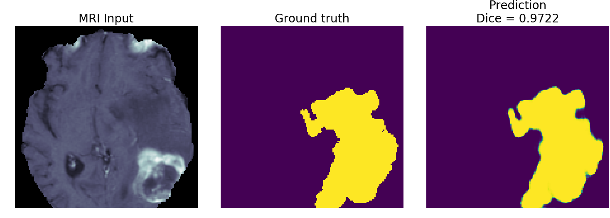
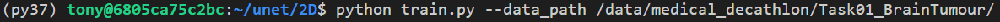
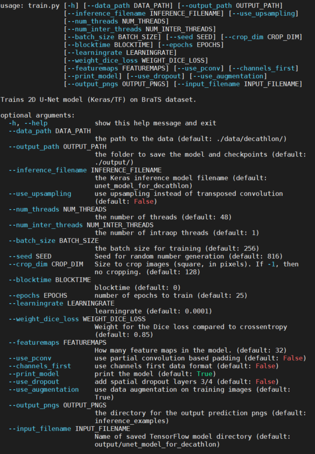
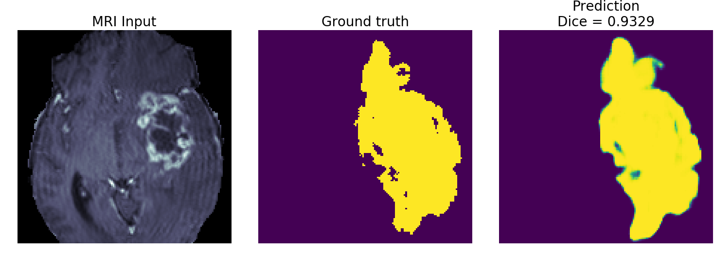

# 2D U-Net for Medical Decathlon Dataset

Please see our blog on the [IntelAI website](https://www.intel.ai/intel-neural-compute-stick-2-for-medical-imaging/)




Trains a 2D U-Net on the brain tumor segmentation (BraTS) subset of the [Medical Segmentation Decathlon](http://medicaldecathlon.com/) dataset.

Steps:
1. Go to the [Medical Segmentation Decathlon](http://medicaldecathlon.com) website and download the [BraTS subset](https://drive.google.com/file/d/1A2IU8Sgea1h3fYLpYtFb2v7NYdMjvEhU/view?usp=sharing). The dataset has the [Creative Commons Attribution-ShareAlike 4.0 International license](https://creativecommons.org/licenses/by-sa/4.0/).

2. Untar the "Task01_BrainTumour.tar" file (e.g. `tar -xvf Task01_BrainTumour.tar`)

3. We use [conda virtual environments](https://www.anaconda.com/distribution/#download-section) to run Python scripts. Once you download and install conda, create a new conda environment with [TensorFlow* with Intel&reg; DNNL](https://software.intel.com/en-us/articles/intel-optimization-for-tensorflow-installation-guide?page=1). Run the command: 
```
conda create -c anaconda -n decathlon pip python=3.7 tensorflow tqdm psutil jupyter matplotlib
```

This has been tested with [TensorFlow 2.2](https://anaconda.org/anaconda/tensorflow-mkl) on Ubuntu 18.04 Linux.

4. Enable the new environment. Command: 
```
conda activate decathlon
```

5. Install the package [nibabel](http://nipy.org/nibabel/). Command: 
```
pip install nibabel
```

6. Run the command 
```
python train.py --data_path $DECATHLON_ROOT_DIRECTORY
```
where $DECATHLON_ROOT_DIRECTORY is the root directory where you un-tarred the Decathlon dataset.



7. [OpenVINO&trade;](https://www.youtube.com/watch?v=kY9nZbX1DWM) - At the end of `train.py` you should see instructions on how to [convert the model](https://docs.openvinotoolkit.org/latest/openvino_docs_MO_DG_prepare_model_convert_model_Convert_Model_From_TensorFlow.html) for use with the [Intel&reg; Distribution of the OpenVINO&trade; toolkit](https://software.intel.com/content/www/us/en/develop/tools/openvino-toolkit.html). Once you have OpenVINO&trade; installed, you can run a command like the one below to create an OpenVINO&trade; intermediate representation (IR) of the TensorFlow model. If you are using the [Intel&reg; Neural Compute Stick&trade; (NCS2)](https://ark.intel.com/content/www/us/en/ark/products/140109/intel-neural-compute-stick-2.html), simply replace the `FP32` with `FP16` in the command below:

```
source /opt/intel/openvino_2021/bin/setupvars.sh
python $INTEL_OPENVINO_DIR/deployment_tools/model_optimizer/mo_tf.py \
       --saved_model_dir ./output/2d_unet_decathlon \
       --input_shape [1,128,128,4] \
       --model_name 2d_unet_decathlon \
       --output_dir ./output/FP32 \
       --data_type FP32
```

This has been tested with the [Intel&reg; Distribution of the OpenVINO&trade; toolkit](https://software.intel.com/content/www/us/en/develop/tools/openvino-toolkit.html) 2021.2.

8. Once you have the OpenVINO&trade; IR model, you can run the command:

```
python plot_openvino_inference_examples.py --data_path $DECATHLON_ROOT_DIRECTORY --device CPU
```

It should give you the same output as the `plot_tf_inference_examples.py` but execute faster on the same CPU. You can try the options `--device GPU` or `--device=MYRIAD` if you have the [Intel&reg; integrated GPU](https://ark.intel.com/content/www/us/en/ark/products/graphics/197532/intel-iris-plus-graphics.html) or [Intel&reg; Neural Compute Stick&trade; (NCS2)](https://ark.intel.com/content/www/us/en/ark/products/140109/intel-neural-compute-stick-2.html) installed on your computer.

For a complete demo showing the [Intel&reg; Neural Compute Stick&trade; (NCS2)](https://ark.intel.com/content/www/us/en/ark/products/140109/intel-neural-compute-stick-2.html) try out the [Intel&reg; DevCloud for the Edge](https://devcloud.intel.com/edge/advanced/sample_applications/). You'll be able to try running inference on lots of Intel&reg; hardware using the same OpenVINO&trade; pipeline.


Tips for improving model:
* The feature maps have been reduced so that the model will train using under 12GB of memory.  If you have more memory to use, consider increasing the feature maps using the commandline argument `--featuremaps`. The results I plot in the images subfolder are from a model with `--featuremaps=32`. This will increase the complexity of the model (which will also increase its memory footprint but decrease its execution speed).
* If you choose a subset with larger tensors (e.g. liver or lung), it is recommended to add another maxpooling level (and corresponding upsampling) to the U-Net model. This will of course increase the memory requirements and decrease execution speed, but should give better results because it considers an additional recepetive field/spatial size.
* Consider different loss functions.  The default loss function here is a weighted sum of `-log(Dice)` and `binary_crossentropy`. Different loss functions yield different loss curves and may result in better accuracy. However, you may need to adjust the `learning_rate` and number of epochs to train as you experiment with different loss functions. The commandline argument `--weight_dice_loss` defines the weight to each loss function (`loss = weight_dice_loss * -log(dice) + (1-weight_loss_dice)*binary_cross_entropy_loss`).






REFERENCES:

1. Menze BH, Jakab A, Bauer S, Kalpathy-Cramer J, Farahani K, Kirby J, Burren Y, Porz N, Slotboom J, Wiest R, Lanczi L, Gerstner E, Weber MA, Arbel T, Avants BB, Ayache N, Buendia P, Collins DL, Cordier N, Corso JJ, Criminisi A, Das T, Delingette H, Demiralp Γ, Durst CR, Dojat M, Doyle S, Festa J, Forbes F, Geremia E, Glocker B, Golland P, Guo X, Hamamci A, Iftekharuddin KM, Jena R, John NM, Konukoglu E, Lashkari D, Mariz JA, Meier R, Pereira S, Precup D, Price SJ, Raviv TR, Reza SM, Ryan M, Sarikaya D, Schwartz L, Shin HC, Shotton J, Silva CA, Sousa N, Subbanna NK, Szekely G, Taylor TJ, Thomas OM, Tustison NJ, Unal G, Vasseur F, Wintermark M, Ye DH, Zhao L, Zhao B, Zikic D, Prastawa M, Reyes M, Van Leemput K. "The Multimodal Brain Tumor Image Segmentation Benchmark (BRATS)", IEEE Transactions on Medical Imaging 34(10), 1993-2024 (2015) DOI: 10.1109/TMI.2014.2377694

2. Bakas S, Akbari H, Sotiras A, Bilello M, Rozycki M, Kirby JS, Freymann JB, Farahani K, Davatzikos C. "Advancing The Cancer Genome Atlas glioma MRI collections with expert segmentation labels and radiomic features", Nature Scientific Data, 4:170117 (2017) DOI: 10.1038/sdata.2017.117

3. Simpson AL, Antonelli M, Bakas S, Bilello M, Farahani K, van Ginneken B, Kopp-Schneider A, Landman BA, Litjens G, Menze B, Ronneberger O, Summers RM, Bilic P, Christ PF, Do RKG, Gollub M, Golia-Pernicka J, Heckers SH, Jarnagin WR, McHugo MK, Napel S, Vorontsov E, Maier-Hein L, Cardoso MJ. "A large annotated medical image dataset for the development and evaluation of segmentation algorithms." https://arxiv.org/abs/1902.09063 


### Optimization notice
Please see our [optimization notice](https://software.intel.com/en-us/articles/optimization-notice#opt-en).

